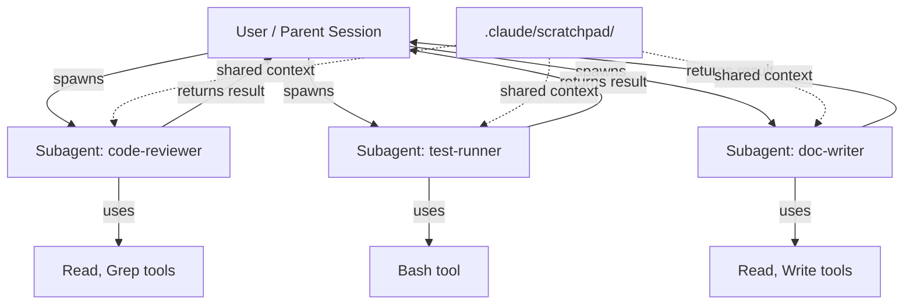

# Claude Code Subagents

A **subagent** is a separate Claude instance that runs a focused task and returns a result to the parent session. Claude Code can spawn subagents automatically (e.g., the Explore tool uses one), and you can define custom subagents for your own workflows.

Think of subagents as workers: the main session is the manager, subagents are specialists you dispatch to do specific jobs in parallel or sequence.

## Table of Contents

1. [How subagents work](./how-subagents-work.md)

## Overview

| Approach | Where defined | Best for |
|----------|--------------|----------|
| Directory files | `.claude/agents/<name>/AGENT.md` | Reusable agents with specific capabilities |
| CLI flag | `--agents '[{"name":"...","prompt":"..."}]'` | One-off agents when starting a session |
| Agent SDK | TypeScript/Python SDK `AgentSession` | Embedding agents in external applications |

## Three ways to define custom subagents

### 1. Directory files (most common)

Create a markdown file in `.claude/agents/` with YAML frontmatter:

```
your-project/
└── .claude/
    └── agents/
        └── code-reviewer/
            └── AGENT.md
```

```yaml
---
name: code-reviewer
description: Reviews code changes for quality and security issues
tools: Read, Glob, Grep
permissionMode: default
maxTurns: 10
---

You are a code reviewer. When invoked, analyze the provided code changes for:
- Logic errors
- Security vulnerabilities
- Performance issues
- Style consistency

Return a structured report with severity ratings.
```

### 2. CLI JSON flag

Pass agents as JSON when starting Claude:

```bash
claude --agents '[{"name":"reviewer","prompt":"Review this code for security issues","tools":["Read","Grep"]}]'
```

### 3. Agent SDK

For embedding in external applications — see [Agent SDK/README.md](../Agent%20SDK/README.md).

---

## Subagent-specific frontmatter fields

These fields only apply to agent files (not skills or commands):

| Field | Type | What it does |
|-------|------|-------------|
| `tools` | string (comma-sep) | Whitelist of tools this agent can use. Omit to inherit all tools. |
| `disallowedTools` | string (comma-sep) | Tools this agent explicitly cannot use. |
| `permissionMode` | enum string | Permission mode for this agent (`default`, `auto`, `bypassPermissions`, etc.) |
| `maxTurns` | integer | Max conversation turns before the agent stops. Prevents runaway agents. |
| `mcpServers` | list | MCP servers available to this agent. |
| `memory` | enum string | Memory scope — `none`, `project`, `user`, or `team`. |
| `background` | boolean | If true, agent runs asynchronously (doesn't block the parent session). |
| `isolation` | enum string | Isolation level — `none`, `container`, `worktree`. |
| `color` | enum string | Color used in the UI to identify this agent's output. |

Full field definitions: [Skills/FRONTMATTER.md](../Skills/FRONTMATTER.md) (the same frontmatter schema applies to agents).

---

## Agent relationship diagram



Agents run in parallel by default. The parent session receives results as `<task-notification>` messages.

---

## Plugin subagent restriction

> **Important:** Subagents defined inside a **plugin** cannot use `hooks`, `mcpServers`, or `permissionMode` frontmatter fields. These fields are silently ignored for plugin-origin agents. Only standalone `.claude/agents/` files support the full set of agent frontmatter.

---

## See also

- [How subagents work](./how-subagents-work.md) — spawning, context, and result flow
- [Skills/FRONTMATTER.md](../Skills/FRONTMATTER.md) — all 29 frontmatter fields (agents share the same schema)
- [Coordinator/README.md](../Coordinator/README.md) — multi-agent coordinator mode (advanced)
- [Agent SDK/README.md](../Agent%20SDK/README.md) — embedding agents in external apps
- [GettingStarted/README.md](../GettingStarted/README.md) — general getting started guide

---

[← Back to docs/README.md](../README.md)
