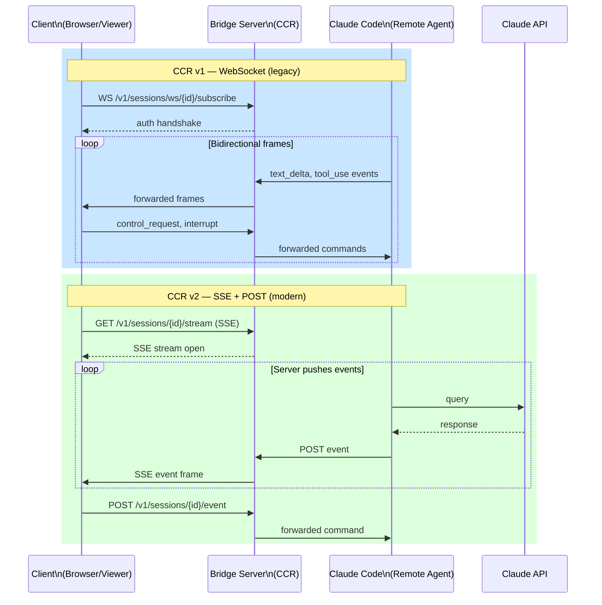

# How the Bridge Works

The Bridge enables Claude Code to execute in remote environments (Cloud Container Runtime / CCR) and viewer-only sessions, extending from the local CLI to cloud-hosted agents. Two transport protocols exist: WebSocket (v1, legacy) and Server-Sent Events / SSE (v2, modern).

## Bridge transport protocols

## CCR v1: WebSocket Transport

**Classic remote control** uses a persistent WebSocket connection to the Bridge server.

- **Endpoint**: `/v1/sessions/ws/{sessionId}/subscribe`
- **Handshake**: Client authenticates with `{ type: 'auth', credential: { type: 'oauth', token } }`
- **Message format**: Bidirectional JSON frames (text_delta, control_request, interrupt, etc.)
- **Connection lifetime**: Persistent until session end or network failure
- **Reconnection**: Automatic with 2s backoff, max 5 attempts
- **Ping**: 30s keepalive ping from server to client

**Limitations**: Single long-lived connection; prone to idle timeout in corporate proxies (solved by keep-alive frames in v2).

## CCR v2: Server-Sent Events (SSE) Transport

**Modern remote control** uses one-directional SSE for server→client streaming, with HTTP POST for client→server requests.

- **Inbound (SSE stream)**: `GET /v1/sessions/{sessionId}/stream` with OAuth token in `Authorization` header
- **Outbound (POST requests)**: `POST /v1/sessions/{sessionId}/event` with event payload
- **Frame format**: Standard SSE (`event:`, `id:`, `data:` fields)
- **Connection lifetime**: Auto-reconnect on disconnect; 45s silence = dead connection
- **Backoff**: Exponential 1–30s, reset on successful frame
- **Close codes**: 
  - **4001** (session not found) = transient; reconnect allowed
  - **401 / 403** (auth failure) = permanent close; no retry
  - **500s** (server error) = transient; backoff + retry
- **Silence timeout**: 45s without any server frame = client initiates reconnect

**Advantages**: Survives corporate proxies; SSE frames prevent idle timeout; separate POST channel allows stateless outbound events.

## Session Lifecycle

### Startup Phase

1. **CLI resolves session**: From `/api/oauth/profile` (org UUID) or from environment (CCR container)
2. **Obtain work secret**: Decrypt or retrieve ingress token + API config
3. **Initialize transport**: 
   - **v1**: WebSocket handshake + auth
   - **v2**: Open SSE stream + POST channel ready
4. **Send init message**: `initialize` control request with model, permissions, env

### Message Flow

- **Server → Client** (inbound): text_delta, control_request, error, end_turn
- **Client → Server** (outbound): text_delta, interrupt, permission_grant, internal events
- **Keep-alive**: v2 sends heartbeat frames every 120s (bridge-only, configurable via `tengu_bridge_poll_interval_config.session_keepalive_interval_v2_ms`)

### Shutdown Phase

1. **End turn**: Client sends final text_delta with `eos: true`
2. **Consume final events**: Flush any pending control_requests or permission prompts
3. **Close connection**: 
   - **v1**: WebSocket close frame
   - **v2**: Stop listening to SSE stream, pending POSTs complete

## Transport Selection

**When CCR v2 (SSE) is used**:
- Environment variable `CLAUDE_CODE_USE_CCR_V2` is set OR
- Statsig feature flag `tengu_bridge_repl_v2` is enabled OR
- CLI version ≥ floor specified in `tengu_bridge_min_version` (Statsig; separate thresholds for v1/v2)

**Default**: v1 (WebSocket) unless explicitly upgraded.

## Echo Deduplication

A `BoundedUUIDSet` ring buffer (fixed capacity) filters duplicate message IDs on transport swap or re-delivery:

- Tracks recently-seen message UUIDs
- On reconnect with transport upgrade (e.g., v1→v2), prevents echo of in-flight events
- **Ring behavior**: Oldest entry drops when buffer fills; space-efficient for high-frequency sessions

---

[← Back to Bridge/README.md](./README.md)
