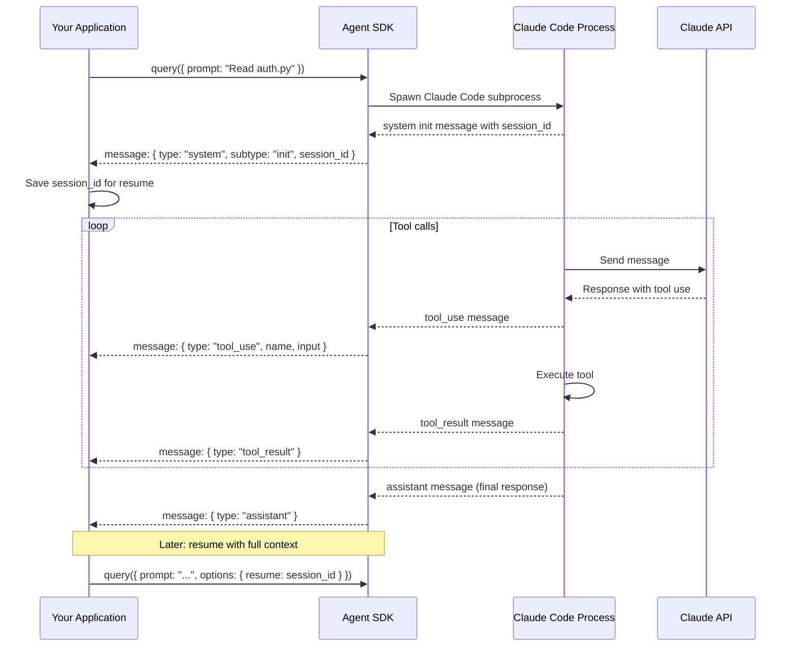

# Session lifecycle

## SDK session flow



### Creation
A query with no `session_id` in options creates a new session. The first message from the SDK yields a `system` message with subtype `init` containing the `session_id`. Capture this ID to resume later.

```typescript
// First query: capture session ID
for await (const message of query({ prompt: "Read auth.py" })) {
  if (message.type === "system" && message.subtype === "init") {
    sessionId = message.session_id;
  }
}

// Later: resume with full context
for await (const message of query({ 
  prompt: "Now find all callers", 
  options: { resume: sessionId } 
})) { }
```

### Resuming
Set `options.resume` (TypeScript) or `options={'resume': session_id}` (Python) to pick up an existing session with all prior context: conversation history, file read state, session variables.

### Aborting
Call `query.interrupt()` (TypeScript) or `await q.interrupt()` (Python) to pause the agent without canceling in-flight tool calls. Call `await query.close()` (TypeScript) to forcefully terminate.

### Interrupting
The `interrupt()` method pauses the agent at the next safe point, allowing you to inject new user messages or change permissions.

### Set-mode (mid-flight)
Call `query.setPermissionMode(mode)` (TypeScript) or `await q.set_permission_mode(mode)` (Python) to change permission handling immediately, mid-conversation. New mode applies to all subsequent tool requests.

### Completion
Session ends naturally when the agent finishes (no more user messages, max_turns hit, or stop hook triggers), or explicitly via `abort()` / `close()`.

---

[← Back to Agent SDK/README.md](./README.md)
