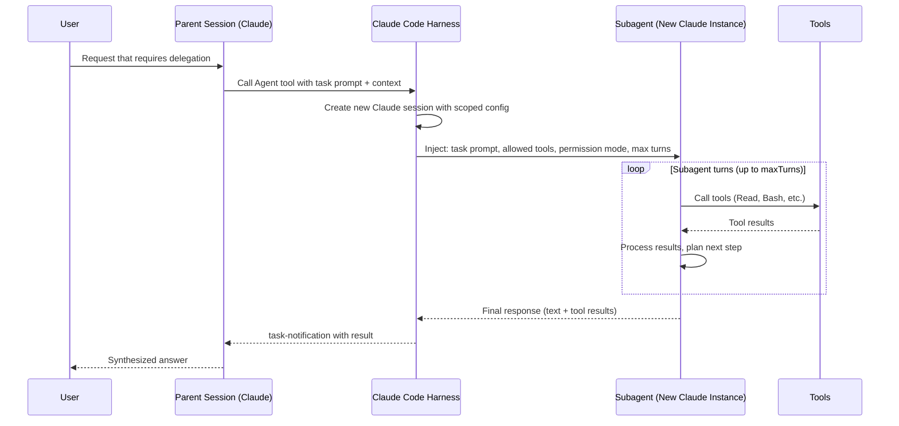

# How Subagents Work

This page explains what happens under the hood when Claude Code spawns a subagent — how context is passed, how the agent runs, and how results come back to the parent session.

---

## The spawning sequence



---

## What context the subagent receives

When a subagent is spawned, it gets:

- **The task prompt** — either the inline prompt from the `Agent` tool call, or the content of the AGENT.md file
- **Its allowed tools** — from the `tools` field in frontmatter, or the `Agent` tool call's tools list
- **Its permission mode** — from the `permissionMode` field (defaults to the same as the parent if not set)
- **Its memory scope** — if `memory` is set, the agent reads from that memory scope at startup
- **MCP servers** — if `mcpServers` is set, those servers are available to the agent

The subagent does **not** receive:
- The parent session's conversation history (it starts fresh)
- The parent session's permission rules (it uses its own `permissionMode`)
- Variables or state from the parent (only what's in files or the task prompt)

---

## How results come back

When a subagent finishes, its response is delivered as a `<task-notification>` XML message in the parent session. The parent Claude reads this and can:

- Synthesize the result into its response to you
- Spawn another agent based on what it found
- Continue the parent session's work

For background agents (`background: true` in frontmatter), the notification arrives asynchronously — the parent session continues running while the agent works.

---

## Parallel vs. sequential agents

Claude Code can run multiple agents in parallel:

```
Parent session
├── Agent A: "scan for security vulnerabilities"  (running)
├── Agent B: "check test coverage"               (running)
└── Agent C: "review documentation"              (running)
```

All three run simultaneously. The parent waits for all three notifications before synthesizing a final report.

Sequential agents are less common but used when each task depends on the previous result.

---

## Scratchpad: sharing context between agents

When the `tengu_scratch` Statsig flag is enabled on your account, agents can share information via `.claude/scratchpad/`:

```
.claude/
└── scratchpad/
    ├── findings.md       ← Agent A writes here
    ├── test-results.md   ← Agent B writes here
    └── doc-issues.md     ← Agent C writes here
```

The parent session (and any agent) can read all scratchpad files. This is the coordination primitive for multi-agent workflows. Without the `tengu_scratch` flag, this directory is not available.

---

## Agent isolation levels

The `isolation` field controls how isolated the agent's filesystem view is:

| Level | What it means |
|-------|--------------|
| `none` (default) | Agent sees the same filesystem as the parent session |
| `worktree` | Agent gets a separate git worktree (isolated from your working changes) |
| `container` | Agent runs in a container (most isolated; requires container support) |

For agents doing risky or experimental work, `worktree` isolation means their changes don't affect your main branch until you merge them.

---

## Subagent vs. coordinator mode

**Basic subagent** (what this page describes):
- Parent calls the `Agent` tool with a prompt
- One subagent spawns, does the task, returns a result
- Parent synthesizes and continues

**Coordinator mode** (see [Coordinator/README.md](/claude-code-docs/agents/overview/)):
- Requires `CLAUDE_CODE_COORDINATOR_MODE=1`
- Claude becomes a full orchestrator managing many workers
- Workers have a specific tool whitelist, scratchpad access, and auto-dispatch
- More powerful, more complex — not needed for basic use cases

If you're just adding custom agents to your project, you don't need coordinator mode.

---

## See also

- [Agents/README.md](/claude-code-docs/agents/overview/) — subagent overview and definition methods
- [Coordinator/README.md](/claude-code-docs/agents/overview/) — full multi-agent orchestration
- [Skills/FRONTMATTER.md](/claude-code-docs/skills/overview/) — all agent frontmatter fields
- [GettingStarted/feature-gates-guide.md](/claude-code-docs/getting-started/feature-gates-guide/) — scratchpad and agent team feature gates

---

[← Back to Agents/README.md](/claude-code-docs/agents/overview/)
