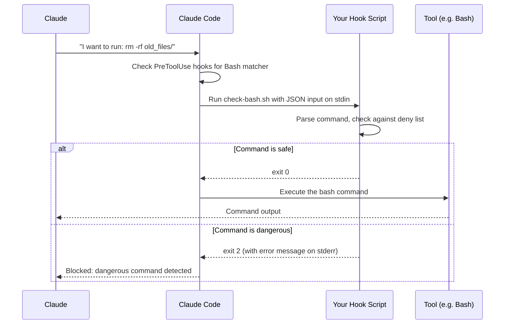

import { Steps } from '@astrojs/starlight/components';

# Your First Hook

A **hook** runs a script automatically when something happens in Claude Code — like before Claude runs a bash command, or after Claude edits a file. Hooks let you enforce policies, log activity, validate changes, or integrate with external systems.

:::tip[Quick version]
Add a `hooks` entry to `.claude/settings.json` pointing to a shell script. The script runs before/after tool use and can allow or block the action based on exit code.
:::

---

## The most common use case

Block Claude from running dangerous shell commands, even if you accidentally approve them:

<Steps>

1. **Create the hook script**

   Create `.claude/hooks/check-bash.sh`:

   ```bash
   #!/bin/bash
   # Read the hook input (JSON with tool name and command details)
   INPUT=$(cat)

   # Extract the command being run
   COMMAND=$(echo "$INPUT" | python3 -c "import json,sys; d=json.load(sys.stdin); print(d.get('tool_input', {}).get('command', ''))")

   # Block dangerous patterns
   if echo "$COMMAND" | grep -qE '(rm -rf /|DROP TABLE|> /dev/sda)'; then
     echo "Blocked: dangerous command detected" >&2
     exit 2
   fi

   # Allow everything else
   exit 0
   ```

2. **Register the hook in settings**

   Add to `.claude/settings.json`:

   ```json
   {
     "hooks": {
       "PreToolUse": [
         {
           "matcher": "Bash",
           "handler": {
             "type": "command",
             "command": ".claude/hooks/check-bash.sh"
           }
         }
       ]
     }
   }
   ```

3. **Claude now checks every bash command**

   Every time Claude wants to run a bash command, your script runs first. If it exits with code `2`, Claude stops. If it exits with code `0`, Claude proceeds.

</Steps>

---

## What "blocking" means — exit codes

The exit code from your script is the decision:

| Exit code | Meaning |
|-----------|---------|
| `0` | Proceed normally — Claude runs the tool |
| `2` | Block — Claude stops and does not run the tool |
| Any other | Ignored — Claude proceeds (treat as 0) |

This is how you'd prevent Claude from running `rm -rf` commands, accidentally overwriting production configs, or making network requests to internal services.

---

## How hook events flow



---

## The JSON input your script receives

When Claude Code calls your hook, it passes JSON to your script's stdin:

```json
{
  "event": "PreToolUse",
  "tool_name": "Bash",
  "tool_input": {
    "command": "rm -rf old_files/",
    "description": "Remove old files"
  },
  "session_id": "abc123"
}
```

For `PostToolUse`, you also get `tool_result` with the output.

Parse it with `python3 -c "import json,sys; d=json.load(sys.stdin); ..."` or `jq` if you prefer.

---

## Hook event types

The most useful events for beginners:

| Event | Fires when | Blockable? |
|-------|-----------|------------|
| `PreToolUse` | Before any tool runs | Yes — exit 2 to block |
| `PostToolUse` | After a tool succeeds | Yes — exit 2 to undo/flag |
| `SessionStart` | When a session begins | No |
| `Stop` | When Claude finishes a response | Yes — exit 2 to continue |
| `FileChanged` | When a watched file changes | No |

For the full list of 26 events, see [Hooks/event-reference.md](/claude-code-docs/hooks/event-reference/).

---

## A complete walkthrough: logging all file edits

Here's a hook that logs every file Claude edits to a file, which you can review later:

**`.claude/hooks/log-edits.sh`**
```bash
#!/bin/bash
INPUT=$(cat)
FILE=$(echo "$INPUT" | python3 -c "
import json, sys
d = json.load(sys.stdin)
print(d.get('tool_input', {}).get('file_path', 'unknown'))
")
echo "$(date '+%Y-%m-%d %H:%M:%S') Claude edited: $FILE" >> .claude/edit-log.txt
exit 0
```

**`.claude/settings.json`**
```json
{
  "hooks": {
    "PostToolUse": [
      {
        "matcher": "Write",
        "handler": {
          "type": "command",
          "command": ".claude/hooks/log-edits.sh"
        }
      }
    ]
  }
}
```

This hook runs after every `Write` tool call (not before, so it can't block — it just logs).

---

## Hook configuration fields

```json
{
  "hooks": {
    "PreToolUse": [
      {
        "matcher": "Bash",
        "handler": {
          "type": "command",
          "command": "path/to/script.sh",
          "timeout": 5000
        }
      }
    ]
  }
}
```

| Field | Required | What it does |
|-------|----------|-------------|
| `matcher` | No | Filter by tool name (e.g., `"Bash"`, `"Write"`). Omit to match all tools for this event. |
| `handler.type` | Yes | `"command"` (shell script), `"http"` (webhook), `"prompt"` (ask Claude), `"agent"` (subagent) |
| `handler.command` | Yes (for type: command) | Path to your script. Relative to project root. |
| `handler.timeout` | No | Milliseconds before the hook is killed (default: 60000) |

---

## Troubleshooting

**Hook never fires**
- Check JSON syntax in settings.json — a typo breaks all hooks
- Make sure the event name is spelled correctly (`PreToolUse`, not `pre-tool-use`)
- Check that `matcher` matches the tool name exactly (`"Bash"` not `"bash"`)

**Hook fires but doesn't block**
- Exit code 2 blocks; anything else (including exit 1) does not block
- Make sure your script actually exits — infinite loops hang the session

**Script can't find my file**
- Hooks run with the project root as the working directory
- Use relative paths from the project root, or absolute paths

---

## Next steps

- [Hooks/event-reference.md](/claude-code-docs/hooks/event-reference/) — all 26 events with matcher support
- [Hooks/handler-types.md](/claude-code-docs/hooks/handler-types/) — `command`, `http`, `prompt`, `agent` handlers
- [Hooks/security-model.md](/claude-code-docs/hooks/security-model/) — SSRF protection and env var allowlists for http hooks
- [Hooks/how-event-hooks-work.md](/claude-code-docs/hooks/how-event-hooks-work/) — scope precedence and async execution

---

[← Back to GettingStarted/README.md](/claude-code-docs/getting-started/overview/)
