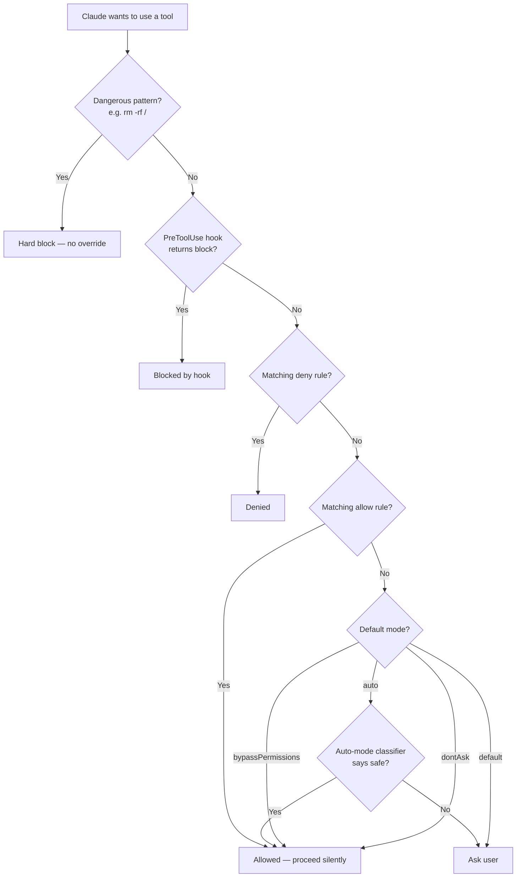

# Your First Permission Rule

By default, Claude asks for your approval before editing files, running commands, or fetching URLs. Permission rules let you pre-approve (or permanently block) specific actions so Claude can work without interrupting you every time.

> **Quick version:** Add `Write(src/**)` to `permissions.allow` in `.claude/settings.json` and Claude will edit files under `src/` without asking.

---

## The two-minute answer

Open (or create) `.claude/settings.json` in your project root and add:

```json
{
  "permissions": {
    "allow": [
      "Write(src/**)",
      "Bash(npm run *)"
    ]
  }
}
```

Now Claude can edit any file under `src/` and run any `npm run` script without asking you first.

---

## Before and after

**Before** (no rules): Every time Claude wants to edit a file, you see:

```
Claude wants to edit src/utils/format.ts
[Allow once] [Allow for this session] [Allow always] [Deny]
```

**After** (with `Write(src/**)` in `allow`): Claude edits the file silently. You stay in flow.

---

## How permission evaluation works



Rules are checked in this order: **deny first, then allow, then default mode**. The first matching rule wins.

---

## Rule syntax

Rules follow the pattern `Tool(pattern)`. The pattern depends on the tool:

| Tool | Pattern | Example |
|------|---------|---------|
| `Write` | File glob | `Write(src/**)` — any file under src/ |
| `Read` | File glob | `Read(~/.zshrc)` — your zshrc file |
| `Edit` | File glob | `Edit(**/*.ts)` — any TypeScript file |
| `Bash` | Command prefix | `Bash(npm *)` — any npm command |
| `Bash` | Exact command | `Bash(npm run test)` — exactly this command |
| `WebFetch` | Domain | `WebFetch(domain:anthropic.com)` — this domain and subdomains |
| `WebSearch` | (none) | `WebSearch` — all web searches |

### Glob patterns for file rules

```
src/**        → any file anywhere under src/
src/*.ts      → .ts files directly in src/ (not subdirectories)
**/*.test.ts  → any .test.ts file anywhere
~/.zshrc      → your home directory zshrc
```

### Bash patterns

```
Bash(npm *)         → any npm command (npm install, npm run test, etc.)
Bash(npm run *)     → any npm run script, but not npm install
Bash(git status)    → exactly "git status", nothing else
Bash(* install)     → any install command (npm install, pip install, etc.)
```

---

## allow vs. deny

```json
{
  "permissions": {
    "allow": [
      "Write(src/**)"
    ],
    "deny": [
      "Write(src/secrets/**)",
      "Bash(rm *)"
    ]
  }
}
```

- `allow` — Claude proceeds without asking
- `deny` — Claude is blocked entirely (can't even ask you)

Deny rules are evaluated first. In this example, `Write(src/secrets/**)` would be blocked even though `Write(src/**)` allows the parent directory.

---

## Permission modes

For bigger changes to Claude's default behavior, use `defaultMode`:

```json
{
  "permissions": {
    "defaultMode": "auto"
  }
}
```

| Mode | Behavior |
|------|----------|
| `default` | Ask for everything not explicitly allowed (safest) |
| `auto` | Use heuristics to auto-approve "safe" actions; ask for risky ones |
| `acceptEdits` | Auto-approve file edits; ask for shell commands |
| `dontAsk` | Never ask — approve everything not explicitly denied |
| `bypassPermissions` | Skip all permission checks (use only in trusted automation) |
| `plan` | Claude plans actions but never executes them |

**Recommendation for most junior developers:** Start with `default` (the default). Add specific `allow` rules for things you approve of often. Only switch to `auto` once you've used Claude enough to trust its judgment in your project.

---

## Where to put settings.json

| Location | Scope | Notes |
|----------|-------|-------|
| `.claude/settings.json` | Project only | Checked into git. Shared with your team. |
| `~/.claude/settings.json` | All your projects | Personal preferences. Never checked in. |
| `.claude/settings.local.json` | Project only | Personal overrides. Add to `.gitignore`. |

For permission rules that apply to one project, use `.claude/settings.json`.

---

## Troubleshooting

**Claude still asks even with an allow rule**
- Check the rule syntax — `Write(src/**)` not `Write(src/*)` for recursive match
- Make sure your file is at `.claude/settings.json` (not `claude/settings.json`)
- Check that the JSON is valid (no trailing commas, correct quotes)

**Claude was blocked by a deny rule I didn't expect**
- Deny rules check the full path — if you deny `Write(/tmp/*)` and allow `Write(src/**)`, a file in `/tmp/` is still denied
- Check for rules in `~/.claude/settings.json` (your global settings might have deny rules)

---

## Next steps

- [Permissions/rule-grammar.md](../Permissions/rule-grammar.md) — full rule syntax reference
- [Permissions/permission-modes.md](../Permissions/permission-modes.md) — all 6 modes explained
- [Permissions/rule-scopes.md](../Permissions/rule-scopes.md) — how managed/project/user rules interact
- [Settings/permissions-security.md](../Settings/permissions-security.md) — all permission-related settings keys

---

[← Back to GettingStarted/README.md](./README.md)
