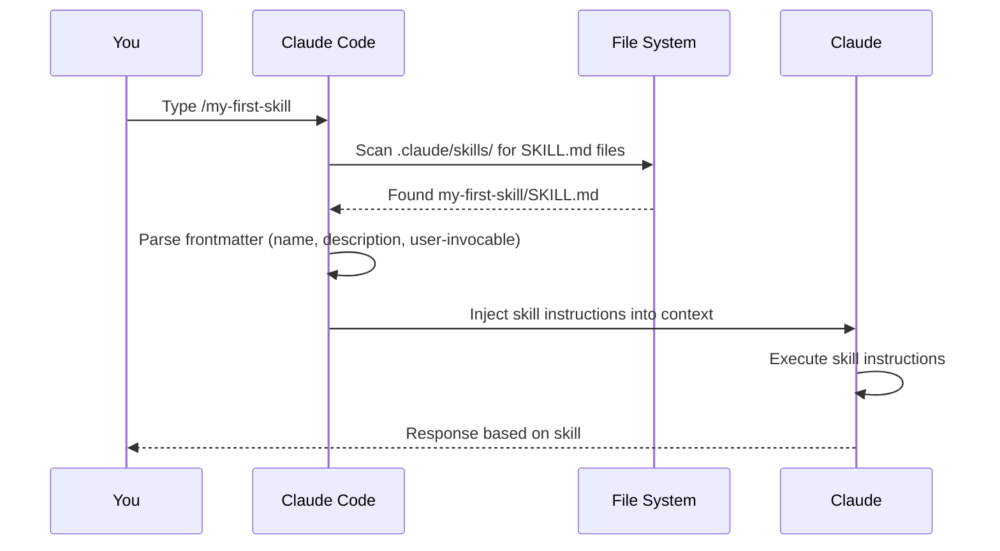

# Your First Skill

A **skill** is a custom slash command you write as a markdown file. When you type `/my-skill` in Claude Code, Claude reads that file and uses it as instructions for the task. Skills are great for repeating workflows: code reviews, commit message formatting, documentation generation, or anything you do more than once.

> **Quick version:** Create a file at `.claude/skills/my-skill/SKILL.md` with YAML frontmatter at the top, write your instructions, and type `/my-skill` to use it.

---

## Step 1 — Create the skill file

Create this directory structure in your project:

```
your-project/
└── .claude/
    └── skills/
        └── my-first-skill/
            └── SKILL.md
```

Create `.claude/skills/my-first-skill/SKILL.md` with this content:

```yaml
---
name: my-first-skill
description: Summarizes the current git diff in plain English
user-invocable: "true"
---

Please summarize the current `git diff` output in plain English. Focus on:
- What files changed
- What the change does (not how)
- Whether anything looks risky

Keep the summary under 5 bullet points.
```

---

## Step 2 — The frontmatter fields explained

The section between `---` markers is YAML frontmatter. It tells Claude Code how to load and expose the skill.

| Field | What it does |
|-------|-------------|
| `name` | The slug used for the slash command. Must be lowercase with hyphens only. |
| `description` | Shown when Claude decides whether to invoke this skill automatically. |
| `user-invocable` | Set to `"true"` (with quotes!) to make it available as `/my-first-skill`. |

### The most common beginner mistake

> **Always write `user-invocable: "true"` with quotes around `true`.**

Without quotes, YAML converts `true` to a boolean. The parser that reads this field expects a string, so it silently ignores the value and your skill won't appear in the `/` menu. This is the #1 reason a freshly created skill doesn't show up.

```yaml
# Wrong — YAML makes this a boolean, parser ignores it
user-invocable: true

# Correct — string value the parser recognizes
user-invocable: "true"
```

The same rule applies to `disable-model-invocation: "true"` if you use that field.

---

## Step 3 — Invoke the skill

Restart your Claude Code session (or type `/reload`), then type:

```
/my-first-skill
```

Claude will run a `git diff`, then summarize it according to your instructions.

---

## How skill discovery works



Skills are scanned from these locations (in priority order):
1. `.claude/skills/` in your current project
2. `~/.claude/skills/` in your home directory (shared across all projects)
3. Plugin skills (if you have plugins installed)

---

## Minimum viable frontmatter

The only required field is `name`. Everything else has a default:

```yaml
---
name: my-skill
---
```

This creates a skill named `my-skill` that Claude can invoke automatically (but you can't type `/my-skill` — for that you need `user-invocable: "true"`).

---

## Common skill patterns

### Skills with arguments

```yaml
---
name: explain-function
description: Explains what a function does
argument-hint: <function-name>
user-invocable: "true"
---

Explain the function named `$ARGUMENTS` in the current file. Cover:
- What it does
- What each parameter means
- What it returns
- Any edge cases
```

Use: `/explain-function calculateTax`

### Skills that only Claude can invoke (not you)

```yaml
---
name: check-style
description: Checks code for style violations before every commit
user-invocable: "false"
---

Review the staged changes for style violations...
```

With `user-invocable: "false"`, Claude decides when to invoke this automatically. You can't call it with `/check-style`.

### Skills limited to specific tools

```yaml
---
name: safe-review
description: Reviews code without running any commands
allowed-tools: Read, Glob, Grep
user-invocable: "true"
---

Review the code changes without executing any commands. Read-only analysis only.
```

---

## Troubleshooting

**Skill doesn't appear in the `/` menu**
- Check `user-invocable: "true"` — make sure the value has quotes
- Restart Claude or type `/reload`
- Check for YAML syntax errors (colons, indentation)

**Skill appears but does nothing useful**
- The instructions after the frontmatter are just markdown — Claude reads them as a prompt
- Make them specific: "Do X, then Y, then output Z" works better than "Help with X"

**Skill runs but ignores my `allowed-tools` restriction**
- `allowed-tools` limits which tools Claude *can* use in this skill, not which ones it *will* use
- If you need strict isolation, combine with a permission rule

---

## Next steps

- See [Skills/FRONTMATTER.md](../Skills/FRONTMATTER.md) for all 29 frontmatter fields
- See [Skills/adding-your-own-skills.md](../Skills/adding-your-own-skills.md) for all the places skills can live on disk
- See [Skills/publicly-documented-bundled-skills.md](../Skills/publicly-documented-bundled-skills.md) for the 14 skills that ship with Claude Code (good examples to read)

---

[← Back to GettingStarted/README.md](./README.md)
