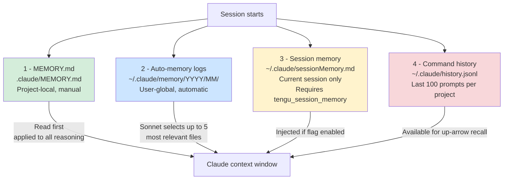

# How Memory Works

Claude Code maintains memory across sessions through four complementary systems, each optimized for different use cases and lifespans.

## The four memory systems

| System | Scope | Lifespan | Manual or auto? |
|--------|-------|----------|----------------|
| MEMORY.md | Project | Until deleted | Manual |
| Auto-memory logs | User global | Indefinite | Automatic |
| Session memory | User global | Current session | Automatic (gated) |
| Command history | User global | Configurable | Automatic |

## The four memory systems

### 1. MEMORY.md entrypoint

Every project's `.claude/` directory can contain a `MEMORY.md` file. This is a user-maintained index of important facts about the project—goals, architecture decisions, patterns, known issues. When Claude loads project context, it reads this file first and applies it to all subsequent reasoning. MEMORY.md is the most explicit, user-controlled form of memory.

Key properties:
- **Scope**: Project-local
- **Lifespan**: Until manually edited/deleted
- **Cap**: 200 lines OR 25KB (whichever fires first); excess triggers a warning asking to move detail into topic files
- **Auto-scanned**: Yes; appears first in context before auto-memory files

### 2. Auto-memory logs

Claude automatically saves key facts to `~/.claude/memory/YYYY/MM/YYYY-MM-DD.md` (one file per day). These logs capture insights that emerge during conversations—newly discovered APIs, architecture decisions, debugging results—without requiring manual saves.

Key properties:
- **Scope**: User global (accessible from all projects)
- **Lifespan**: Indefinite, but staleness warnings appear for entries older than 1 day
- **Scan behavior**: 200-file cap (newest-first), then a Sonnet subagent selects up to 5 most-relevant files for injection into context
- **Auto-enabled by default**: Unless `CLAUDE_CODE_DISABLE_AUTO_MEMORY=1`, `--bare` mode, or project setting `autoMemoryEnabled: false`

### 3. Session memory

A background subagent periodically extracts key information from the current conversation into `~/.claude/sessionMemory.md`. This lets Claude recall decisions and findings within the same session without re-reading the entire message history.

Key properties:
- **Scope**: User global
- **Lifespan**: Current session only (reset between sessions)
- **Feature gate**: `tengu_session_memory` (off by default)
- **Token budgets**: Thinking max 1024, extraction max 2048
- **Trigger**: Initialized after N tool calls or conversation length; updated periodically thereafter

### 4. Command history

A global index at `~/.claude/history.jsonl` stores the last 100 prompts per project (indexed by project name), accessible via prompt up-arrow. Large text pastes (>1024 chars) are stored separately in `~/.claude/paste-store/` by content hash and referenced as `[Pasted text #N +M lines]`.

Key properties:
- **Scope**: User global
- **Lifespan**: Configurable retention; newest-first within each project
- **Indexed by**: Project name
- **Paste cache**: Content-addressed (hash-based) to deduplicate identical pastes

## Loading order and priority

When starting a conversation:

1. **MEMORY.md** (if exists): Scanned first, applied directly to system prompt
2. **Auto-memory files**: Up to 5 most-relevant files (selected by Sonnet from 200-file scan) injected after MEMORY.md
3. **Agent memories**: Per-agent-type user and project memories loaded if present
4. **Team memory**: Shared team context (CCR only, if enabled)
5. **Session memory**: Current conversation notes (if enabled)

## Memory types classification

Files in memory directories can be tagged with a `type:` frontmatter field to hint at their purpose. The four standard types are:

- `user` — Personal insights, conventions, learned practices
- `feedback` — Captured user feedback, feature requests, bug reports
- `project` — Project-specific findings, architecture, code patterns
- `reference` — External links, documentation excerpts, API specs

During recall, the Sonnet selector may weight files by type and recency to pick the 5 most relevant. Type is optional; untyped files are still scanned.

## Storage and sync boundaries

- **Local auto-memory** (`~/.claude/memory/`): Stored locally, NOT synced to CCR
- **Agent memories** (`~/.claude/agent-memory/`): User-scoped, synced if CCR enabled
- **Local-only agent memory** (`.claude/agent-memory-local/`): Never synced; project-local only
- **Team memory** (`CLAUDE_CODE_REMOTE_MEMORY_DIR/projects/<project>/team-memory/`): Team-scoped (CCR only), requires feature gate `isTeamMemoryEnabled()`

---

[← Back to Memory/README.md](/claude-code-docs/memory/overview/)
