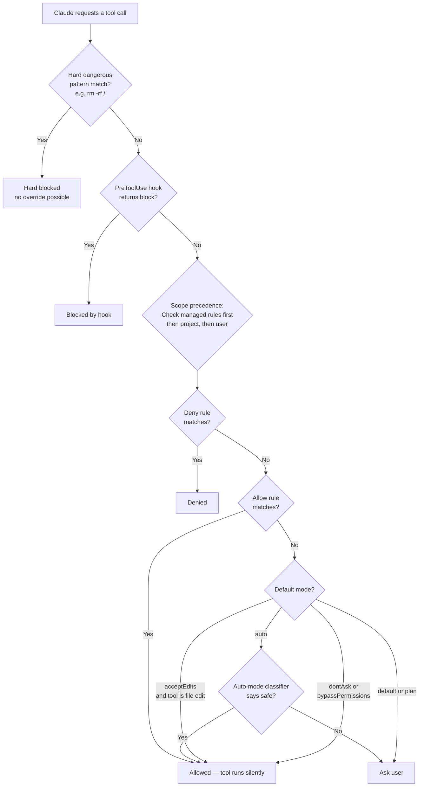

# How permissions are evaluated

## Evaluation flowchart

- When Claude requests a tool invocation, the harness matches applicable permission rules against the tool name and optional pattern (e.g., command text, file path, domain).
- Rules are evaluated in precedence order: **deny rules first** → ask rules → allow rules → default mode fallback.
- The **first matching rule wins**. A tool blocked by deny is never allowed by an allow rule at the same scope level.
- **Scope precedence**: managed settings > local project settings > project settings > user settings. Managed rules override all others.
- `PreToolUse` hooks fire *before* permission evaluation and can block (exit 2) or defer decisions, but cannot override deny rules. See [Hooks and permissions](/claude-code-docs/permissions/hooks-and-permissions/).
- **Auto-mode classifiers** (internal heuristics, not user-configurable) can auto-approve "safe" patterns even without explicit allow rules when `auto` mode is active. See [Auto-mode classifiers](/claude-code-docs/permissions/auto-mode-classifiers/).
- **Dangerous patterns** like `rm -rf /`, `curl | sh`, and similar OS-level destructive patterns are blocked by a hard safety layer (`dangerousPatterns.ts`) regardless of allow rules—this layer runs after rule evaluation.
- **Shadowed rules** (a narrow rule covered by a broader one at the same source, e.g., `Bash(npm run test)` shadowed by `Bash(npm *)`) are detected and surfaced as warnings at startup. See [Discrepancies & notes](/claude-code-docs/permissions/overview/).

---

[← Back to Permissions/README.md](/claude-code-docs/permissions/overview/)
