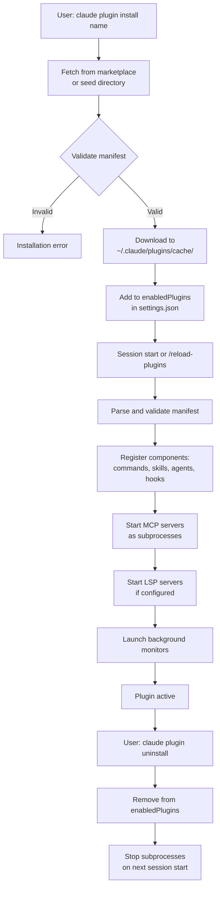

# Plugin lifecycle

## Lifecycle flow

### Discovery
Plugins are discovered from:
- **Configured marketplaces:** Loaded from Git repositories, the official Anthropic marketplace (if enabled), or custom sources added via `extraKnownMarketplaces` setting.
- **Seed directories:** The `CLAUDE_CODE_PLUGIN_SEED_DIR` environment variable can point to a local directory for pre-seeding plugins at startup.
- **CLI:** The `claude plugin install` command searches configured marketplaces.
- **In-session UI:** The `/plugin` command opens the marketplace browser.

### Installation
1. User runs `claude plugin install <name>[@marketplace]` (CLI) or `/plugin` → "Discover" (UI).
2. Claude Code fetches the plugin from the specified marketplace (or searches all configured marketplaces).
3. Plugin is downloaded to the local plugin cache: `~/.claude/plugins/cache/<plugin-id>/<version>/`.
4. Plugin is added to the user's `enabledPlugins` in the target scope's `settings.json` (user, project, or local).

### Validation
- `validatePlugin.ts` checks manifest syntax (JSON, required fields, semantic version format).
- Schema validation via Zod: paths are relative and start with `./`, component directories exist, manifest fields match expected types.
- Component files (skills, agents, commands) are checked for frontmatter syntax.
- Path traversal checks prevent plugins from referencing files outside their directory.

### Loading
When a session starts or `/reload-plugins` is invoked:
1. **Manifest loading:** The manifest is parsed and validated.
2. **Component registration:** Commands, skills, agents, hooks, MCP servers, and LSP servers are registered with the runtime. Plugin skills use namespaced names (`/plugin-name:skill-name`).
3. **Hook registration:** Hooks are merged across all sources (user, project, plugin, managed) and attached to their event handlers.
4. **MCP server startup:** Enabled MCP servers are spawned as subprocesses.
5. **LSP server startup:** Enabled LSP servers are started (users must have binaries installed).
6. **Monitor startup:** Background monitors are launched as long-running processes.

### Enable/disable
- Enabled plugins load at session start. Settings key: `enabledPlugins[<plugin-id>] = true/false`.
- Toggling is done via `/plugin` UI or `claude plugin enable/disable` CLI commands.
- Per-scope (user, project, local, managed): each scope has its own `settings.json` or managed config.
- Managed-only plugins (from managed settings) cannot be disabled by users.

### Reload
- `/reload-plugins` command reloads all plugins without restarting the session.
- Re-parses manifests, re-registers components, restarts MCP/LSP servers.
- Useful for development or applying updates during an active session.

### Auto-update
- Controlled by `FORCE_AUTOUPDATE_PLUGINS` environment variable (global) or per-plugin `autoUpdate` field.
- Claude Code periodically checks for new versions and updates automatically if enabled.
- Users can manually update via `claude plugin update <name>` or `/plugin` → "Update".

### Uninstall
- `claude plugin uninstall <name>` removes the plugin from the scope's `settings.json`.
- By default, the plugin's data directory (`${CLAUDE_PLUGIN_DATA}`) is deleted when uninstalling from the last scope.
- `--keep-data` flag preserves the data directory for reinstallation later.

---

[← Back to Plugins/README.md](/claude-code-docs/plugins/overview/)
