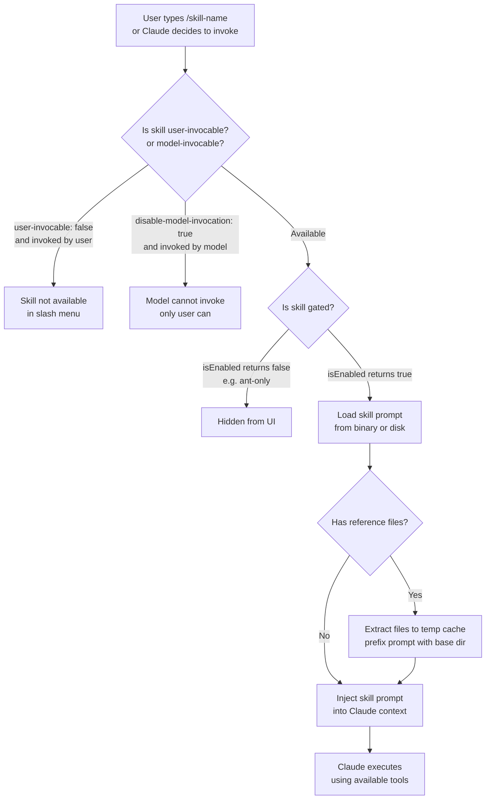

# How bundled skills work

## Skill invocation flow

- **Registered at startup**: Each bundled skill definition calls `registerBundledSkill({ name, description, ... })` once when the CLI initializes. The definition compiles into the binary—not markdown files on disk.
- **Prompt builder pattern**: Unlike built-in commands that execute fixed logic, bundled skills use a `getPromptForCommand()` function that returns the skill's instructions as a dynamic prompt. Claude then orchestrates the work using tools.
- **Gating via `isEnabled()`**: The optional `isEnabled` function controls whether a skill appears in the UI and is available to the model. Common checks: `USER_TYPE === 'ant'` (Anthropic staff only), feature flags, remote-mode availability, or permission policies.
- **Reference files extracted to disk**: Some bundled skills include a `files` map (reference documentation, templates, etc.). On first invocation, these files are extracted to a temporary cache directory, and the skill prompt is prefixed with `Base directory for this skill: <dir>` so Claude can Read/Grep them on demand, just like disk-based skills.
- **Invocation control via frontmatter**:
  - `user-invocable: true` (default) — appears in the `/` menu and can be invoked with `/skill-name`
  - `user-invocable: false` — hidden from the `/` menu; only Claude can invoke via the Skill tool
  - `disable-model-invocation: true` — Claude cannot invoke; only users can invoke via `/skill-name`
  - `disableModelInvocation: false` (default) — Claude can load and invoke the skill automatically when relevant
- **Aliases**: Some skills have aliases (alternative names). For example, `/loop` also responds to `/proactive`.
- **Exposed as slash commands**: A subset of bundled skills are also listed in the [Commands reference](/en/commands), marked as **[Skill]**, and can be invoked directly. Examples: `/batch`, `/simplify`, `/loop`, `/debug`, `/claude-api`.

---

[← Back to Skills/README.md](/claude-code-docs/skills/overview/)
